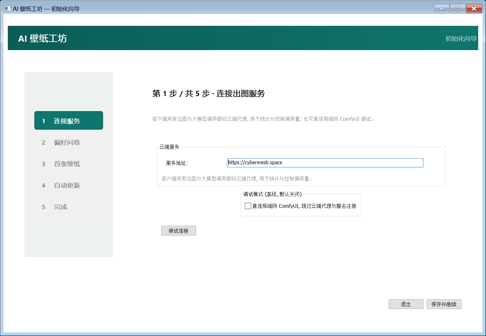
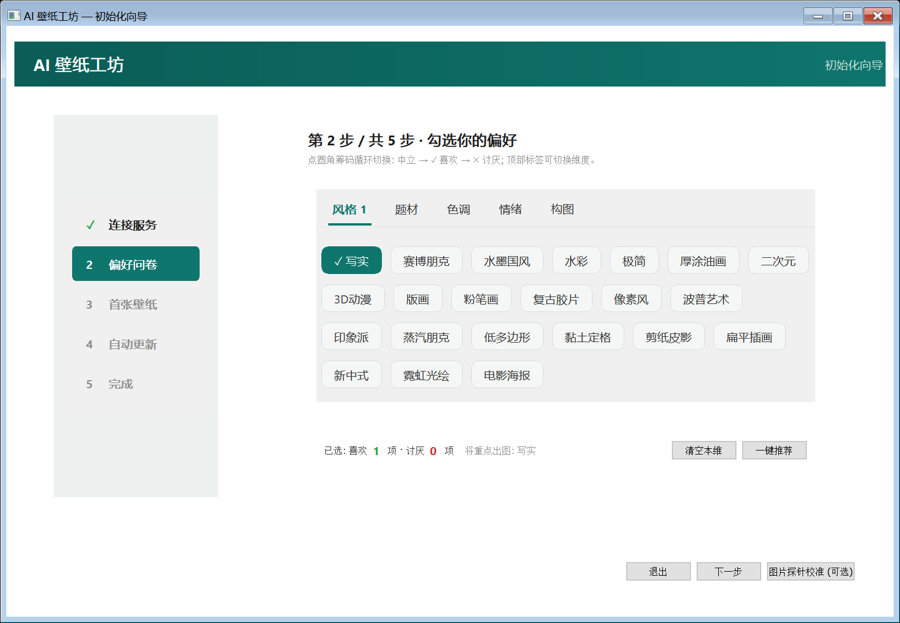

# AI Wallpaper Workshop

[中文](README.md) | [English](README.en.md)

> Every hour, your desktop makes itself beautiful. A Windows tool that generates images with AI — for you alone — and changes your wallpaper automatically.

<p align="center">
  
  
</p>
<p align="center"><sub>All images above are real outputs of this project: prompts are planned by a cloud LLM from your preference profile and history</sub></p>

**AI Wallpaper Workshop** is not a wallpaper gallery — it is a wallpaper generator that works for you alone:
a Windows scheduled task fires silently every hour → a cloud LLM plans the prompt from your preference profile and recent history →
ComfyUI (Z-Image Turbo) renders the image → it is fitted to your screen's physical resolution → the desktop wallpaper is replaced. **You do nothing.**

No sign-up, no login, no tray icon, no resident process — close the window and there is no process left in the system.

**Current version: v1.0.3** · Website [cybermesh.space](https://www.cybermesh.space) · Client is a ~10 MB single file.

## Download

| Channel | URL | Notes |
| --- | --- | --- |
| Website | https://www.cybermesh.space | Click "Download the Windows client" |
| Gitee Release (recommended in China) | https://gitee.com/QQ941748/ai-wallpaper-workshop/releases | Download the latest `AIWallpaper.exe` |
| GitHub Release (mirror) | https://github.com/941748/ai-wallpaper-workshop/releases | Same file, faster overseas |

- Requirements: Windows 10 / 11 (64-bit).
- After downloading, double-click `AIWallpaper.exe` to run the setup wizard; automatic wallpaper changes begin once the wizard is done.
- **Existing users never upgrade manually**: the client checks for updates silently on each cycle, then downloads, verifies and swaps itself in.

## Features

- **Effortless preference learning**: a five-dimension questionnaire (style / subject / palette / mood / composition) plus probe-image picks build your profile;
  afterwards it detects preference drift from your natural actions (re-running the wizard, re-applying a past wallpaper, satisfaction check-ins) and quietly refines the profile.
- **Hourly automatic refresh**: the scheduled task launches a process that lives for seconds — it renders, swaps, and exits, with nothing running in the background.
- **Cloud LLM planning + silent fallback**: the LLM plans the next image from your profile, the last 10 rounds, and drift events;
  if it is unreachable or times out, it falls back to the local weighted-sampling engine transparently.
- **Festival & solar-term context**: near the 24 solar terms and major festivals, the mood of the image subtly echoes the occasion (e.g. carnation-toned soft light for Mother's Day) — atmosphere only, no text banners; can be turned off in one click.
- **Local backup pool, works offline**: the machine always keeps up to 3 pre-generated wallpapers; once consumed, the pool is **refilled to cover the whole deficit at once** (up to 3 per round); swaps stay instant even offline or when the render queue is busy.
- **Pre-generation pool**: when the render machine is idle it pre-generates the next round, so a hit changes the wallpaper in ~10 seconds (saving the ~30 seconds of on-demand rendering).
- **Never intrusive**: quiet hours, full-screen apps, and the lock screen are all skipped; satisfaction check-ins follow a memory curve (3→7→15→30→60→90 days, capped) — fewer prompts, but they never disappear.
- **Privacy-friendly**: anonymous token, zero sign-up; profile and history stay entirely on your machine; all outbound calls go through the cloud service you self-host.
- **Lightweight**: the client is a ~10 MB single file (compiled Go, no runtime dependencies).

## Screenshots

Five-step wizard: connect to the service → preference questionnaire (five-dimension tri-state chips, with one-click recommend / probe calibration) → first wallpaper → register the hourly task → done.

<p align="center">
  
  
</p>

<p align="center">
  
</p>

## How it works

```
┌──────────── Windows client (single file, ~10 MB) ────────────┐
│  Wizard / Settings (walk, self-drawn)   Scheduled task --tick  │
│  Local prompt engine (fallback)         Profile / history /    │
│                                         drift signals          │
└─────────────────────────┬─────────────────────────────────────┘
                  HTTPS (anonymous token, outbound only)
┌─────────────────────────▼─────────────────────────────────────┐
│  Cloud service (Go + SQLite single binary, self-hosted)        │
│  Anonymous signup / quota / rate limit   LLM planning (default │
│  Render queue normal / idle              Xiaomi MiMo; any      │
│  Pre-gen pool / probe pool / silent update  OpenAI-compatible) │
└─────────────────────────┬─────────────────────────────────────┘
                  LAN HTTP (render machine)
┌─────────────────────────▼─────────────────────────────────────┐
│  ComfyUI (Z-Image Turbo, ~30 s/image at 1080p on a consumer GPU)│
└────────────────────────────────────────────────────────────────┘
```

### How preferences are "learned"

1. **Tri-state questionnaire**: 74 tags across five dimensions (style 22 / subject 36 / palette 6 / mood 5 / composition 5),
   picked as "like / neutral / dislike" and mapped to profile weights (0.9 / 0.3 / 0.05).
2. **Probe calibration (optional)**: pick preferences over 12 balanced-combination probe images to infer finer initial weights.
3. **Drift detection**: only real user actions are adopted (re-running the wizard, re-applying a wallpaper, adjusting weights, check-in choices);
   the profile is refined once same-direction evidence accumulates. It never relies on guessed signals like "how long a wallpaper survived", avoiding intrusion and misjudgement.

## Quick start

### Option 1: Direct mode (self-contained, for users who already have a GPU + ComfyUI)

**No cloud service needed**: in wizard step 1, tick "Connect to a LAN ComfyUI directly" and enter the address — rendering and wallpaper changes work in full
(prompts come from the local engine, no LLM required).

1. Prepare ComfyUI and the models (see "ComfyUI checklist" below).
2. Build or download the client (see "Download" and "Build").
3. Double-click to run → tick direct mode in the wizard → enter `http://127.0.0.1:8188` → finish the wizard.

### Option 2: Cloud mode (recommended, works even without a GPU)

1. A render machine: ComfyUI + a consumer NVIDIA GPU (Z-Image Turbo, ~30 s/image at 1080p).
2. A server (may be the same machine): compile and run the cloud service (see "Cloud service deployment"), configure the LLM key.
3. In wizard step 1, enter the cloud service address → done.

## Build

Requirements: Go 1.22+ (windows/amd64). Dependencies are only `lxn/walk`, `golang.org/x/sys`, `golang.org/x/image`,
`golang.org/x/text`, `skip2/go-qrcode`, `modernc.org/sqlite` (pure Go, no CGO).

```powershell
# One-shot build: run tests → dist\wallpaper.exe (GUI, no console) + dist\aiwallpaper-cloud.exe
powershell -ExecutionPolicy Bypass -File build.ps1

# When deploying the cloud service to a Linux server, build the Linux binary
$env:AW_BUILD_OS = "linux"; powershell -ExecutionPolicy Bypass -File build.ps1
```

Day-to-day development:

```powershell
go test ./...     # all unit/integration tests (incl. cross-module end-to-end: real tick ↔ real cloud ↔ mock ComfyUI/LLM)
go vet ./...
go build -trimpath -ldflags "-s -w -H=windowsgui" -o dist\wallpaper.exe .
```

> Naming note: the build output from source is `dist\wallpaper.exe`; **it is renamed to `AIWallpaper.exe` for distribution**
> (the name users download from the website / Release, and the file that lives in `%LOCALAPPDATA%\AIWallpaper\bin\` after install).

## Project layout

```
wallpaper/
├── main.go                       # no args = GUI (wizard/settings); --tick = one silent run; --apply-update = swap helper
├── build.ps1                     # one-shot build (tests → client → cloud service)
├── assets/workflow_template.json # Z-Image Turbo workflow template (only prompt/size/seed injected)
├── internal/
│   ├── config/                   # config & profile read/write (%LOCALAPPDATA%\AIWallpaper)
│   ├── taxonomy/                 # 5-dimension attribute dictionary (style/subject/palette/mood/composition)
│   ├── probe/                    # probe balanced-combination design + pick → profile inference
│   ├── prompt/                   # local prompt engine (weighted sampling/exploration/dedup/negative)
│   ├── backend/                  # ImageBackend interface + comfyui direct / runninghub reserved
│   ├── desktop/                  # resolution probe/scale-crop/wallpaper swap/quiet detection/low priority
│   ├── scheduler/                # scheduled-task XML generation + schtasks register/delete/run-now
│   ├── store/                    # data dir/file lock/log rotation/wallpaper archive cleanup
│   ├── signals/                  # drift-event collection (reconfig/re-pick/weight change/check-in)
│   ├── cloud/                    # cloud client (signup/get prompt/report/retry queue/probe pool)
│   ├── update/                   # silent self-update (version check/download verify/helper swap)
│   ├── tick/                     # --tick full orchestration (incl. satisfaction check-in & self-update)
│   └── ui/                       # walk native windows: wizard/settings/check-in dialog
├── cloud/                        # standalone cloud service (compiled & deployed separately)
│   ├── main.go                   # wiring + admin dashboard /admin?token=
│   ├── api.go                    # all /api/v1 endpoints
│   ├── comfy.go / queue.go       # ComfyUI forwarding + normal/idle queue (idle pre-generation)
│   ├── prompts.go                # LLM planning + fault-tolerant parsing + local-engine fallback
│   ├── workflows.go              # render-workflow registry (whitelist)
│   ├── llm/client.go             # OpenAI-compatible LLM client (default Xiaomi MiMo)
│   └── store/                    # SQLite: users/prompt_records/signals/jobs/pregen/...
├── site/                         # website static pages (promotion & client download)
└── docs/screenshots/             # README screenshots
```

## Using the client

| How it runs | Behaviour |
| --- | --- |
| Double-click (no args) | First run → setup wizard; afterwards → settings panel. **Closing the window = the process exits immediately** |
| `AIWallpaper.exe --tick` | Fired hourly by the scheduled task: renders and swaps the wallpaper silently with no window, then exits |
| `AIWallpaper.exe --apply-update ...` | Internal swap helper (used by silent self-update; ordinary users need not care) |

Settings panel tabs: Preferences (weight tuning / re-init) | Service & Schedule (address / test connection / interval / task register & delete / change now) |
History (thumbnails / re-apply / open folder) | Sync (anonymous user_id / QR pairing for a new device) | Update & Check-in (version / check for updates / check-in cycle).

All the manual actions above (re-running the wizard, re-applying from History, adjusting weights) are recorded locally as drift events and reported to the cloud,
serving as the basis for the LLM to plan the next prompt.

Data directory `%LOCALAPPDATA%\AIWallpaper\`:

```
config.json          main config (cloud address / phase / quiet hours / satisfaction cycle)
profile.json         preference profile (5-dimension weights + negative fragments)
prompt_history.json  last 200 render combinations (last 30 deduplicated)
cloud_queue.json     offline retry queue (retried for up to 7 days)
signals.json         drift events pending upload
probes\ wallpapers\  probe cache / wallpaper archive (keeps the last 30, excluding the one in use)
bin\AIWallpaper.exe  the official copy made when the wizard registers the scheduled task
logs\runtime.log     runtime log (1 MB × 3, rotated)
```

Uninstall: Settings → Service & Schedule → delete the scheduled task, then delete the directory above.

## ComfyUI checklist

The cloud service forwards rendering over the HTTP API; on the ComfyUI side you only need:

1. Start ComfyUI listening on an address reachable by the cloud service (LAN/tunnel), e.g. `--listen 0.0.0.0 --port 8188`;
   if there is a reverse proxy or auth, set `AW_COMFY_TOKEN` to a Bearer token.
2. Install the models required by the Z-Image Turbo workflow (the render workflow is fixed as `z_image_wallpaper`; only prompt/size/seed are injected,
   all other parameters are frozen in the template):

   - `models/diffusion_models/z_image_turbo_int8_convrot.safetensors` (UNet)
   - `models/text_encoders/qwen_3_4b_fp4_mixed.safetensors` (CLIP, lumina2)
   - `models/vae/ae.safetensors` (VAE)

3. Add more workflows (optional): edit `clouddata/workflows.json` (auto-generated on first start).
   Models and sampling parameters are fixed in the workflow template; the registry only constrains the output size range (min_side/max_side):

   ```json
   [
     {"id":"wf-base","name":"Z-Image Turbo general","checkpoint":"z_image_turbo_int8_convrot.safetensors",
      "steps":8,"cfg":1,"sampler_name":"res_multistep","scheduler":"simple","min_side":512,"max_side":1920},
     {"id":"wf-small","name":"Small-size tier","checkpoint":"z_image_turbo_int8_convrot.safetensors",
      "steps":8,"cfg":1,"sampler_name":"res_multistep","scheduler":"simple","min_side":512,"max_side":1088}
   ]
   ```

   Restart the cloud service after saving; the LLM only picks workflows within the whitelist, and an unknown ID falls back to `wf-base`.
   No client-side change is needed. The default output size is 1920×1080.
4. No ComfyUI node plugins to install: the cloud service ships the standard Z-Image Turbo workflow (CLIP encode →
   AuraFlow sample → KSampler → VAEDecode → SaveImage); only the standard nodes and models above must exist.

## Cloud service deployment

### Environment variables

| Variable | Default | Description |
| --- | --- | --- |
| `AW_ADDR` | `:8707` | Listen address |
| `AW_DATA` | `./clouddata` | Data directory (db/probe pool/finished images/pre-gen/update packages) |
| `AW_LLM_BASE` | `https://token-plan-cn.xiaomimimo.com/v1` | OpenAI-compatible LLM endpoint (default Xiaomi MiMo; any compatible service works) |
| `AW_LLM_KEY` | empty | LLM key (**server-side only**; if empty, prompts fall back to the local engine and images still render) |
| `AW_LLM_MODEL` | `mimo-v2.6-flash` | Model name |
| `AW_COMFY_BASE` | `http://127.0.0.1:8188` | Render machine ComfyUI address (LAN) |
| `AW_COMFY_TOKEN` | empty | Bearer token for accessing ComfyUI (optional) |
| `AW_ADMIN_TOKEN` | empty | Admin dashboard password; when empty the dashboard is disabled (404) |
| `AW_SITE` | `/opt/aiwallpaper/site` | Website static-page directory (built-in site hosting) |
| `AW_QUOTA_GEN_HOUR` / `AW_QUOTA_GEN_DAY` | `6` / `40` | Per-user render quota (429 when exceeded) |
| `AW_QUOTA_LLM_HOUR` / `AW_QUOTA_LLM_DAY` | `8` / `60` | Per-user LLM call quota |

### systemd deployment

```ini
# /etc/systemd/system/aiwallpaper-cloud.service
[Unit]
Description=AI Wallpaper Cloud
After=network.target

[Service]
User=aiwallpaper
WorkingDirectory=/opt/aiwallpaper
Environment=AW_ADDR=127.0.0.1:8707
Environment=AW_DATA=/var/lib/aiwallpaper
Environment=AW_LLM_KEY=<your LLM key>
Environment=AW_COMFY_BASE=http://10.0.0.8:8188
Environment=AW_ADMIN_TOKEN=change-me
ExecStart=/opt/aiwallpaper/aiwallpaper-cloud
Restart=on-failure

[Install]
WantedBy=multi-user.target
```

```bash
sudo systemctl daemon-reload && sudo systemctl enable --now aiwallpaper-cloud
```

### nginx reverse proxy (optional, HTTPS recommended in production)

```nginx
server {
    listen 443 ssl;
    server_name wallpaper.example.com;
    # ssl_certificate ...; ssl_certificate_key ...;

    client_max_body_size 32m;

    location / {
        proxy_pass http://127.0.0.1:8707;
        proxy_set_header Host $host;
        proxy_set_header X-Forwarded-Proto $scheme;
        proxy_read_timeout 120s;
    }
}
```

> Note: the cloud service needs no WebSocket; the whole client flow is HTTP polling, so the reverse proxy needs no extra config.
> The pairing relay page and update-package downloads share the same domain (`/d/{code}`, `/releases/`); the website is hosted by the cloud service itself (`AW_SITE`).

### Admin dashboard

Visit `https://<your-domain>/admin?token=<AW_ADMIN_TOKEN>` in a browser:
see all users (today's LLM/render usage, disabled state), recent render records, drift events, task-queue status, and website traffic stats (PV/UV/downloads).

## Client releases (silent self-update)

1. Bump the version in code (`CurrentVersion` in `internal/update/update.go`), build the new client,
   and rename the artifact to `AIWallpaper-<version>.exe`.
2. Compute the sha256 and size, and write them together with the release notes into the server-side `releases/manifest.json`:

   ```json
   {
     "version": "1.0.3",
     "file": "AIWallpaper-1.0.3.exe",
     "sha256": "<64-hex>",
     "size": 10723328,
     "notes": "v1.0.3: expanded subjects; backup pool refills at once; render-quality upgrade",
     "url": "https://gitee.com/QQ941748/ai-wallpaper-workshop/releases/download/v1.0.3/AIWallpaper.exe"
   }
   ```

   - `file`: the file name relative to the server's `releases/` directory (the default download source).
   - `url` (optional): **download-source override**. When set, all clients (including old versions) immediately download from this address,
     with no client-code upgrade needed — used to switch to a domestic CDN (e.g. a Gitee direct link), temporarily fall back to a mirror, or A/B test a new source.
     When empty, the default `<scheme>://<host>/releases/<file>` address is used.
3. Put the exe into the server's `releases/` directory. **Nothing else to do**: at the tail of each tick the client queries
   `/api/v1/client/latest`; if there is a new version it silently downloads → verifies sha256 + size → a helper process
   (`--apply-update`) atomically swaps it in after the tick exits, taking effect on the next tick.
   Any failed step keeps the old version, logs, and retries next round; self-update runs after the wallpaper swap and never interrupts the main line.

> **Dual-repo + website consistency rule**: for every client release, the version must match across four places —
> the Gitee Release, the GitHub Release (with attachment), the website (download button / version badge / footer), and the server-side `manifest.json`;
> for every source push, the `main` branch and tags of both the Gitee and GitHub repos must stay in sync.

## Data & privacy

- Anonymous `user_id` + a per-device token, zero sign-up/login; no personally identifiable information is collected.
- Cloud storage: per-user prompt/attributes/seed/success per round, drift events, and usage counters (for preference evolution and quota).
- Generated images land only on your machine (30 archived wallpapers) and are temporarily held in the cloud queue (pre-generation, cleaned periodically after pickup).
- Cross-device sync: the old device shows a 6-digit pairing code in Settings (valid 5 minutes, one-time); a new device enters it to reclaim
  `user_id + token + profile`.
- Update packages are downloaded only from the HTTPS address specified in the manifest and verified by sha256 + size; no file from any other source is executed.

## FAQ

- **Does it work offline?** Direct mode is fully local; cloud mode requires the client to reach your cloud service.
- **Render speed and cost?** Z-Image Turbo takes ~30 s/image at 1080p on an RTX 4060;
  at one image per hour, a single consumer GPU can serve dozens of users.
- **Which LLMs are supported?** Any OpenAI-compatible endpoint (default Xiaomi MiMo); with no key configured it uses the local engine automatically, with no loss of function.
- **Why no tray/background process?** This is a design red line: at any moment either a window is open, or it is nowhere in the system.
- **macOS / Linux clients?** Windows only for now (scheduling relies on the Task Scheduler).
- **Content safety?** The workflow and prompts carry built-in negative-prompt constraints; deployers can add moderation on the cloud side as needed.

## Development & acceptance

- `go test ./...` all green (incl. cross-module end-to-end: real tick ↔ real cloud ↔ mock ComfyUI/LLM)
- Double-click `dist\wallpaper.exe` to enter the wizard; after finishing, the wallpaper changes immediately and the scheduled task is registered
- After closing the window, `tasklist | findstr wallpaper` shows no leftover; `schtasks /Run /TN AIWallpaper` swaps silently with no window
- Run offline: the old wallpaper is kept, events enter the retry queue, and are reported automatically once reconnected
- Satisfaction check-in dialog on due: Satisfied → cycle increments; Change style → swaps immediately and resets; Later → postponed by 3 days

## License

[AGPL-3.0](https://www.gnu.org/licenses/agpl-3.0.html) — you may freely use, modify, and self-host it;
if you offer a modified version to others as a network service, you must open-source your changes under the same license.
